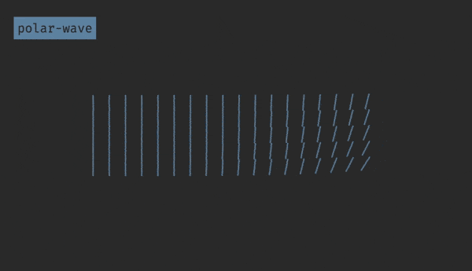

# demo-polar-wave

> Graphic demo of magnetic waves and lines.



## Usage

### Codepen.io

View demo at [http://codepen.io/bramkok/pen/Yqjdvz](http://codepen.io/bramkok/pen/Yqjdvz)

### View demo

Download a [zip file](https://github.com/bramkok/demo-polar-wave/archive/master.zip) and open `index.html`.

### View via local webserver

```
$ npm install
$ npm start
```

### Edit with browser autoreload

#### Requirements
* node
* gulp-cli

```
$ git clone git@github.com:bramkok/demo-polar-wave.git
$ npm install
$ gulp
```

## Related

* Forked from [Hakim El Hattab](http://codepen.io/hakimel/)'s Pen [Strawberry](http://codepen.io/hakimel/pen/aNGqXy/).

* A [Pen](http://codepen.io/bramkok/pen/Yqjdvz) by [Bram Kok](http://codepen.io/bramkok) on [CodePen](http://codepen.io/).

## License

* MIT [License](https://codepen.io/bramkok/pen/Yqjdvz/license).
